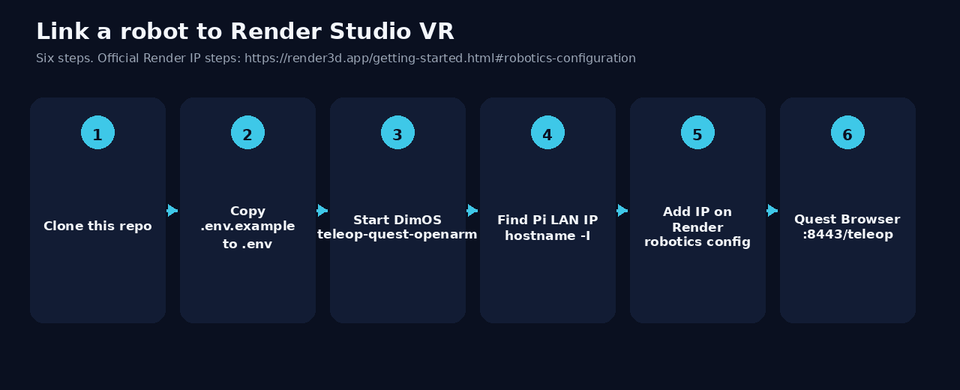
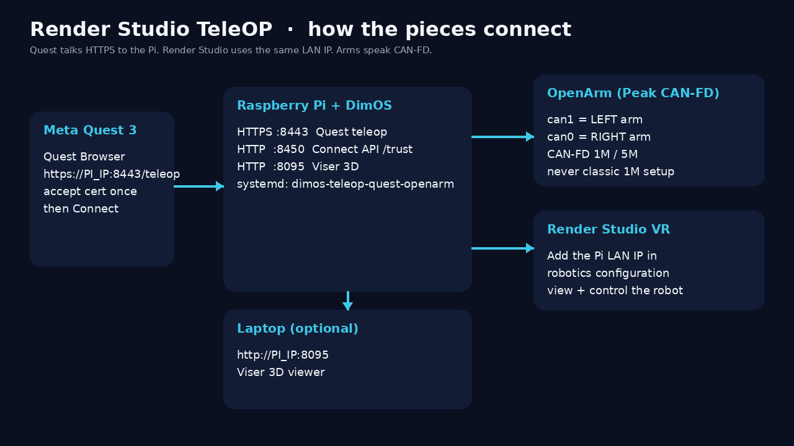
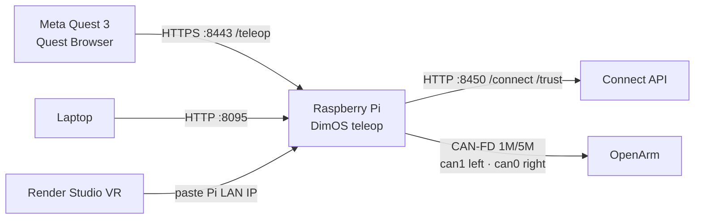
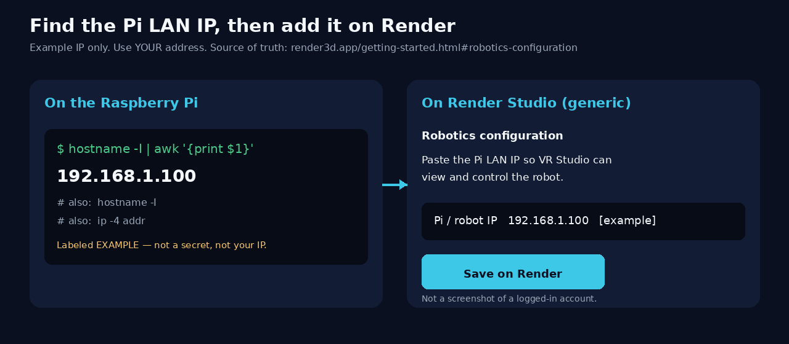
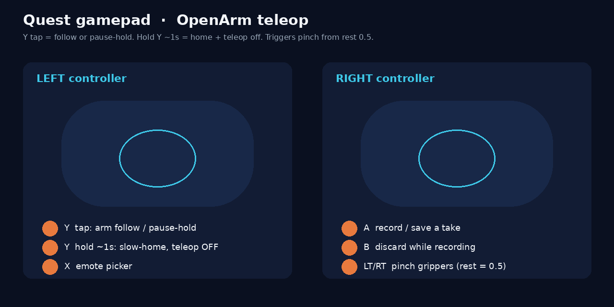
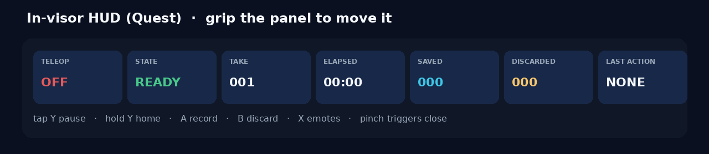
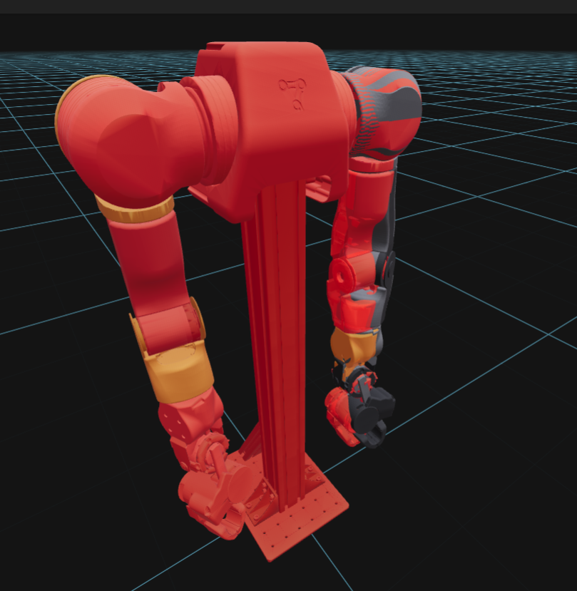

# Render-Studio-TeleOP

This is a repo for linking TeleOP controls from Dimensional's OS to Render Studio. Download and install this to link your robot to Render Studio VR.

Recovering a crashed Pi? Start with [RECOVERY.md](RECOVERY.md). The repository now preserves the last September 29 Pi runtime and the uncommitted DimOS work from the prior two weeks.

It is a **thin linking layer**, not a DimOS dump: setup notes, env placeholders, and a local Connect API. The robot stack is [DimOS](https://github.com/dimensionalOS/dimos) (clone it next to this folder). Licensed under MIT.

**Connect the Pi LAN IP in Render VR Studio** using Render’s robotics configuration docs (source of truth):

[https://render3d.app/getting-started.html#robotics-configuration](https://render3d.app/getting-started.html#robotics-configuration)



| What | URL / value |
| --- | --- |
| GitHub | https://github.com/wprojects/Render-Studio-TeleOP |
| Quest page | `https://<PI_LAN_IP>:8443/teleop` |
| Autoconnect | `https://<PI_LAN_IP>:8443/teleop?autoconnect=1` |
| Connect API | `http://<PI_LAN_IP>:8450` — `GET/POST /connect`, cert trust `/trust` |
| Viser 3D (laptop) | `http://<PI_LAN_IP>:8095` |
| CAN | **can0 = right**, **can1 = left** (Peak PCAN-USB Pro FD, **CAN-FD 1M/5M**) |
| systemd | `dimos-teleop-quest-openarm` (`Restart=always`) |

WebXR needs HTTPS. The Connect API is HTTP so another site can call it without hitting the self-signed 8443 cert. Quest Browser still has to trust that cert **once**.

---

## Architecture





---

## 1. Clone / install this repo

```bash
git clone https://github.com/wprojects/Render-Studio-TeleOP.git
cd Render-Studio-TeleOP
python3 -m pip install -r requirements.txt
cp .env.example .env
```

Edit `.env` with **your** Pi LAN IP and DimOS path. Do not commit `.env`. See [KEYS.md](KEYS.md) for required vs optional names.

---

## 2. Prerequisites

| Need | Notes |
| --- | --- |
| Raspberry Pi | DimOS + this repo on the same machine as the CAN adapter |
| Python (this repo) | [`requirements.txt`](requirements.txt) — FastAPI + Uvicorn for `connect_api.py` |
| Peak **PCAN-USB Pro FD** | Two buses: **can0 = right arm**, **can1 = left arm**. **CAN-FD 1M/5M only** — never classic 1M (`dimos hardware can setup`) |
| Meta Quest | Quest Browser (WebXR). Same LAN as the Pi |
| Render Studio account | You will paste the Pi LAN IP in robotics configuration |
| [DimOS](https://github.com/dimensionalOS/dimos) | Robot OS. Clone as a **sibling** folder, not into this repo |

---

## 3. DimOS (required for the arms)

If DimOS is not already at `../DimOS`:

```bash
cd ..
git clone https://github.com/dimensionalOS/dimos.git DimOS
cd DimOS
curl -LsSf https://astral.sh/uv/install.sh | sh
uv sync
cp ../Render-Studio-TeleOP/.env.example .env
# edit .env — placeholders only in git; put real keys only in local .env
```

---

## 4. Configure env

Copy `.env.example` → `.env` in **this** repo and in **DimOS**. Fill only what you use. Leave unused keys blank.

Full name list (required vs optional): **[KEYS.md](KEYS.md)**. Template: [`.env.example`](.env.example).

| Variable | What to put |
| --- | --- |
| `QUEST_HOST_IP` / `DIMOS_TELEOP_HOST` | Pi LAN IP (example in `.env.example`: `192.168.1.100`) |
| `DIMOS_TELEOP_PORT` | `8443` |
| `DIMOS_CONNECT_API_PORT` | `8450` |
| `DIMOS_ROOT` | Path to DimOS checkout (`../DimOS`) |
| `LEFT_CAN_PORT` / `RIGHT_CAN_PORT` | `can1` / `can0` |
| `DISPLAY` | `:0` on the Pi (Viser / X11) |
| LLM / HF / dimTELE broker keys | **Optional** — Quest + OpenArm + CAN work with these blank. See [KEYS.md](KEYS.md) |

Never put GitHub tokens in `.env`. Prefer `gh auth login`.

---

## 5. Bring up DimOS teleop + Connect API

Start teleop (copy-pasteable):

```bash
cd DimOS
DISPLAY=:0 uv run dimos run teleop-quest-openarm --left-can-port can1 --right-can-port can0
```

24/7 on a Pi with the systemd unit installed:

```bash
sudo systemctl status dimos-teleop-quest-openarm
sudo systemctl start dimos-teleop-quest-openarm
sudo systemctl stop dimos-teleop-quest-openarm
```

The unit uses `Restart=always`.

Optional Connect API (`:8450`) so another site can use a **Connect** button. This repo ships `connect_api.py`; DimOS has `scripts/quest_connect_api.py`.

```bash
# from this repo (uses DIMOS_ROOT from .env)
python3 -m pip install -r requirements.txt
python3 connect_api.py
```

Or from DimOS:

```bash
cd DimOS
uv run python scripts/quest_connect_api.py
```

Then:

- Health / JSON: `http://<PI_LAN_IP>:8450/`
- Connect: `http://<PI_LAN_IP>:8450/connect` (`GET` or `POST` returns the autoconnect URL)
- One-time cert trust: `http://<PI_LAN_IP>:8450/trust`

Quest Browser cannot start WebXR on HTTP. After trusting `https://<PI_LAN_IP>:8443` once, a Connect button can open `https://<PI_LAN_IP>:8443/teleop?autoconnect=1`.

---

## 6. Find your local / LAN IP

On the Raspberry Pi:

```bash
hostname -I | awk '{print $1}'
```

Also useful:

```bash
hostname -I
ip -4 addr
```

Use the address on your **LAN** (often `192.168.x.x` or `10.x.x.x`). The value `192.168.1.100` in `.env.example` is a labeled example, not your Pi.



---

## 7. Add that IP on Render’s site

Paste the Pi LAN IP into Render Studio **robotics configuration** so VR Studio can view and control the robot.

Follow Render’s own steps here (do not guess the dashboard):

**[https://render3d.app/getting-started.html#robotics-configuration](https://render3d.app/getting-started.html#robotics-configuration)**

This README does not include screenshots of a logged-in Render account. Use that page as the source of truth for connecting the IP to Render VR Studio.

---

## 8. Open Quest Browser, accept the cert, Connect

1. On the Quest, open **Quest Browser**.
2. Go to `https://<PI_LAN_IP>:8443/teleop`.
3. Accept the **self-signed certificate once** (advanced / proceed / trust).
4. Tap **Connect**.

Autoconnect (skips the tap after the cert is trusted):

`https://<PI_LAN_IP>:8443/teleop?autoconnect=1`

If the cert warning keeps looping, open `http://<PI_LAN_IP>:8450/trust` first, then return to `/teleop`.

Desktop Chrome is not a substitute for Quest Browser — WebXR teleop is meant for the headset.

---

## 9. Controls, HUD, visor



| Input | Action |
| --- | --- |
| **Y** (left) **tap** | Arm follow from the current pose, or **pause-hold** (gravity / MIT hold) if already following |
| **Y** **hold ~1s** | Slow-home (all 7 joints/arm + grippers, wrists included), then teleop **OFF** |
| **A** (right) | Record / save a take |
| **B** (right) | Discard while recording |
| **X** (left) | Emote picker |
| **Triggers** | Pinch-to-close both grippers from rest **0.5** (half open, not fully spread) |

Do **not** use Hold X+A (old DimOS deadman). OpenArm on this stack is Y-latch, not press-and-hold.



Grip the HUD panel in the visor to move it. Status chips:

- **TELEOP** — `OFF` / `HOLD` / `ON` / `HOMING` / `WAIT` / `PLAY`
- **STATE** — `READY` / `RECORDING` / `OFFLINE`
- **TAKE** / **ELAPSED** / **SAVED** / **DISCARDED** / **LAST ACTION**

Optional laptop 3D view (Viser) while the arms run:

`http://<PI_LAN_IP>:8095`



---

## 10. Troubleshooting

| Symptom | What to check |
| --- | --- |
| Quest cert / NET::ERR_CERT | HTTPS is required. Accept the self-signed cert **once**. Helper: `http://<PI_LAN_IP>:8450/trust`. Then reopen `https://<PI_LAN_IP>:8443/teleop`. |
| Arms never enable / CAN errors | Peak buses must be **CAN-FD 1M/5M**. **Never** `dimos hardware can setup` (that is classic 1M). **can0 = right, can1 = left**. If arms are swapped, swap the two CLI flags only. |
| Works on laptop, not Quest | Use **Quest Browser**, not a desktop tab. WebXR will not start on HTTP. |
| Service crash-loop | `sudo systemctl status dimos-teleop-quest-openarm` and `journalctl -u dimos-teleop-quest-openarm -n 80`. Unit is `Restart=always`. |
| Connect API 503 | Teleop is not listening on `:8443`. Start DimOS teleop first, then `python3 connect_api.py`. |
| Viser blank | Open `http://<PI_LAN_IP>:8095` on a laptop on the same LAN. `DISPLAY=:0` must be set on the Pi. |
| Old X+A deadman | Ignore DimOS G1 docs for this OpenArm stack. **Y tap** follow/pause, **Y hold** home. |

---

## What this repo is (and is not)

**Included:** README + visuals, `.gitignore`, `.env.example` (placeholders), [KEYS.md](KEYS.md), [`requirements.txt`](requirements.txt), `connect_api.py`, MIT `LICENSE`.

**Not included:** DimOS source, `.env`, TLS private keys / `*.pem`, `user_data/`, recordings, `.venv`, and local `Notes.md`.
